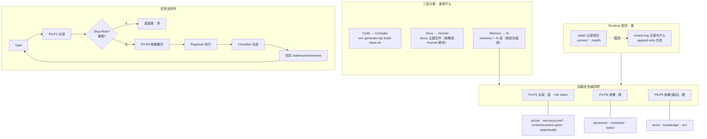

# MDD v4 Architecture（架构图单一事实源 · mermaid）

> 本文件是 v4 架构图的**文本单一事实源**（git-diff 友好，GitHub 可渲染）。
> 视觉版由 AI 在对话中生成；此 mermaid 为可维护源。配色与对话图一致：P0–P2 蓝、P3–P5 绿、P6–P8 橙、Runtime 紫。
> 对应 `memory/boot.md` + `.ai/loading-protocol.md` 的加载协议。

## 配色说明

- **蓝（P0–P2）**：基础上下文，任何任务必读（`.ai/role` + `memory/core/*` + `runtime/current-sprint` + `state/health`）
- **绿（P3–P5）**：决策/契约/任务，按需（decisions / contracts / tasks）
- **橙（P6–P8）**：文档/知识/源码，最后（docs / knowledge / src）
- **紫（Runtime）**：`state/` + `events.log` 配对——记现在 / 记为什么

## 关联

- 加载协议：`.ai/loading-protocol.md` + `memory/boot.md`
- 铁律：`memory/core/principles.md`（Architecture Laws 13 条）+ `loading-priority.md`（Stop Rule）
- 路由模板：`tasks/router-template.md`
- 参考实现：`gh-pages-build/`（V4 · AI Native Operating System）
